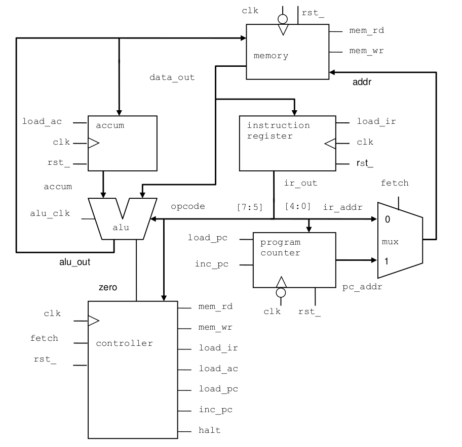

# VerificationPractice: Simple CPU Verification
## Hello!

Below is my attempt a verifiying an extremely simple CPU.

My goal was to use an extremely simple CPU to understand how Systemverilog, UVM, SVA, functional coverage and other verification methodologies work in concert.

I will next work on a more complex project, likely parts of the Berkeley Out-of-Order Machine (BOOM) Core.

Before doing so, I am seeking feedback to calibrate my efforts to industry best practice.  My ultimate goal is to land a job as a DV engineer.

All input is much appreciated.  Thank you!

([Taylor's Current Resume](2023_05_May_22_TaylorTempleton_GithubVersion.pdf)) 

## Simple CPU
This CPU is from a Cadence "systemverilog for design" course.  I used the RTL only, but built the testbench entirely myself.

## EDA Playground Simulations
I use EDA playground as I do not have access to commercial simulators:

| Block                | EDA Playground Simulation            |
|----------------------|--------------------------------------|
| Whole CPU            |                                      |
| Register             | https://www.edaplayground.com/x/d_zE |
| MUX                  | https://www.edaplayground.com/x/v_VC |
| Counter              | https://www.edaplayground.com/x/wXAi |
| Sequencer Controller | https://www.edaplayground.com/x/abRt |
| ALU                  | https://www.edaplayground.com/x/JT9j |
| Memory               | https://www.edaplayground.com/x/K4_Z |

Definition of Terms
-------------------

+---------------+--------------------------------------------------------------------+
| Term          | Defintion                                                          |
+===============+====================================================================+
| BSP           | Board Support Package. A set of support files, such as a C         |
|               | runtime configuration (crt0.S), linker control script (link.ld),   |
|               | etc. that are used to define the software envrionment used by a    |
|               | test-program.                                                      |
+---------------+--------------------------------------------------------------------+
| Committer     | A Contributor who has privileges to approve and merge              |
|               | pull-requests into OpenHW Group GitHub repositories.               |
+---------------+--------------------------------------------------------------------+
| Contributor   | An employee of a Member Company that has been assigned to          |
|               | work on an OpenHW Group project.                                   |
+---------------+--------------------------------------------------------------------+
| CORE-V        | A family of RISC-V cores developed by the OpenHW Group.            |
+---------------+--------------------------------------------------------------------+
| ELF           | Executable and Linkable Format, is a common standard file          |
|               | format for executable files. The RISC-V GCC toolchain              |
|               | compiles C and/or RISC-V Assembly source files into ELF            |
|               | files.                                                             |
+---------------+--------------------------------------------------------------------+
| Instruction   | A behavioural model of a CPU. An ISS can execute the same          |
| Set           | code as a real CPU and will produce the same logical               |
| Simulator     | results as the real thing. Typically only “ISA visible”            |
| (ISS)         | state, such as GPRs and CSRs are modelled, and any                 |
|               | internal pipelines of the CPU are abstracted away.                 |
+---------------+--------------------------------------------------------------------+
| Member        | A company or organization that signs-on with the OpenHW            |
| Company       | Group and contributes resources (capital, people,                  |
| (MemberCo)    | infrastructure, software tools etc.) to the CORE-V                 |
|               | verification project.                                              |
+---------------+--------------------------------------------------------------------+
| Toolchain     | A set of software tools used to compile C and/or RISC-V            |
|               | assembler code into an executable format.                          |
+---------------+--------------------------------------------------------------------+
| Testbench     | In UVM verification environments, a testbench is a                 |
|               | SystemVerilog module that instantiates the device under            |
|               | test plus the SystemVerilog Interfaces that connect to the         |
|               | environment object. In common usage “testbench” can also           |
|               | have the same meaning as verification environment.                 |
+---------------+--------------------------------------------------------------------+
| Testcase      | In the context of the CORE-V UVM verification environment, a       |
|               | a testcase is distinct from a test-program.  A testcase is extended|
|               | from the `uvm_test` class and is used to control the the UVM       |
|               | environment at run-time.                                           |
|               |                                                                    |
|               | In core-v-verif a testcase _may_ be aware of the test-program.     |
+---------------+--------------------------------------------------------------------+
| Test-Program  | A software program, written in C or RISC-V assembly, that executes |
|               | on the simulated RTL model of a core.  Test-Programs may be        |
|               | manually written or machine generated (e.g. riscv-dv).             |
|               |                                                                    |
|               | In core-v-verif a test-program is not aware of the UVM testcase.   |
+---------------+--------------------------------------------------------------------+
| TPE           | Test-program Environment.  A less widely used term for BSP.        |
+---------------+--------------------------------------------------------------------+
| Verification  | An object constructed from a SystemVerilog class that is an        |
| Environment   | extension of `uvm_environment`.  In common usage "verification     |
|               | environment" can also mean the environment object plus all of its  |
|               | members.                                                           |
+---------------+--------------------------------------------------------------------+
| $CORE_V_VERIF | Local path of a cloned working directory of this GitHub repository.|
|               | An example to illustrate:                                          |
|               |                                                                    |
|               | [prompt]$ cd /wrk/rick/openhw                                      |
|               |                                                                    |
|               | [prompt]$ git clone https://github.com/openhwgroup/core-v-verif    |
|               |                                                                    |
|               | Here $CORE_V_VERIF is /wrk/rick/openhw/core-v-verif. Note          |
|               | that this is not a variable the user is required to set. Its use   |
|               | in this document is merely used as a reference point for an        |
|               | absolute path to your working directory.                           |
+---------------+--------------------------------------------------------------------+
| $COREV_CORE   | Shell and Make variable identifying a specific CORE-V core.        |
|               | The most often used example in this document is CV32E40P.          |
+---------------+--------------------------------------------------------------------+

## Verification Plan

|                             | What is the requirement to be verified?                                                        | What type of stimulus was used?        | Name of stim gen code?                                               | Exactly how do you know the stimulus indeed fully tests the requirement? | Exactly how do you know the DUT has passed/failed the requirement? | Where exactly is the code responsible for demonstrating pass/fail?                                                                                                                                                                                                               |
| --------------------------- | ---------------------------------------------------------------------------------------------- | -------------------------------------- | -------------------------------------------------------------------- | ------------------------------------------------------------------------ | ------------------------------------------------------------------ | -------------------------------------------------------------------------------------------------------------------------------------------------------------------------------------------------------------------------------------------------------------------------------- |
| Block                       | Requirement                                                                                    | Stimulus Type?                         | Stimulus Name (test and/or sequence)                              | How do you know stimulus indeed fully tests the design?                  | DUT Pass/Fail Criteria?                                            | Code Name                                                                                                                                                                                                                                                                        |
| Register                    | Reset is asynchronous and active low.                                                          | Constrained Random                     | base_test/base_sequence                                              | covergroup cov_SignalHighLow                                             | Assertion Check                                                    | property resetLow_outZero                                                                                                                                                                                                                                                        |
| Register                    | If enable and rst \_ high, input data is passed to output.                                     | Constrained Random                     | base_test/base_sequence                                              | covergroup cov_SignalHighLow                                             | Assertion check                                                    | property enableHigh_DataOut                                                                                                                                                                                                                                                      |
| Register                    | If rst \_ high and enable low, out is retained in register                                     | Constrained Random                     | base_test/base_sequence                                              | covergroup cov_SignalHighLow                                             | Assertion check                                                    | property rstHighEnableLow_OutStable                                                                                                                                                                                                                                              |
| General Mux                 | Channel A: If sel_a is 1’b1, input in_a is passed to the output.                               | Constrained Random                     | base_test/base_sequence                                              | covergroup cov_sel_a                                                     | Assertion check                                                    | property highSel_a_outin_a                                                                                                                                                                                                                                                       |
| General Mux                 | Channel B: If sel_a is 1’b0, input in_b is passed to the output.                               | Constrained Random                     | base_test/base_sequence                                              | covergroup cov_sel_a                                                     | Assertion check                                                    | property highSel_a_outin_b                                                                                                                                                                                                                                                       |
| General Counter             | rst \_ is asynchronous and active low.                                                         | Constrained Random                     | base_test/base_sequence                                              | covergroup cg_inputcoverage                                              | Assertion check                                                    | property resetLow_outZero                                                                                                                                                                                                                                                        |
| General Counter             | If load is high, the counter is loaded from the input data.                                    | Constrained Random                     | base_test/base_sequence                                              | covergroup cg_inputcoverage                                              | Assertion check                                                    | property loadDataHigh_CountEqualsData                                                                                                                                                                                                                                            |
| General Counter             | If enable is high, the counter is incremented by 1.                                            | Constrained Random                     | base_test/base_sequence                                              | covergroup cg_inputcoverage                                              | Assertion check                                                    | property enableHigh_CountIncrOne                                                                                                                                                                                                                                                 |
| General Counter             | Otherwise, count is unchanged.                                                                 | Constrained Random                     | base_test/base_sequence                                              | covergroup cg_inputcoverage                                              | Assertion check                                                    | property countStable                                                                                                                                                                                                                                                             |
| General Sequence Controller | rst \_ is asynchronous and active low.                                                         | Constrained Random                     | base_test/base_sequence                                              | coverpoint cp_rst_                                                       | Assertion check                                                    | property rstLow_ResetState                                                                                                                                                                                                                                                       |
| General Sequence Controller | Zero is a logic input that is 1 when the CPU accumulator is zero and 0 otherwise.              | Constrained Random                     | base_test/base_sequence                                              |                                                                          | Assertion check                                                    | \-                                                                                                                                                                                                                                                                               |
| General Sequence Controller | 8 controller states transition sequentially, unconditionally.                                  | Constrained Random                     | base_test/base_sequence                                              | coverpoint cp_state                                                      | Assertion check                                                    | property stateINST_ADDRtoINST_FETCH property stateINST_FETCHtoINST_LOAD property stateINST_LOADtoIDLE property stateIDLEtoOP_ADDR property stateOP_FETCHtoALU_OP property stateOP_ADDRtoOP_FETCH property stateALU_OPtoSTORE property stateSTOREtoINST_ADDR |
| General Sequence Controller | Test state/output decode matrix.                                                               | Constrained Random                     | base_test/base_sequence                                              | covergroup cg_decode                                                     | Assertion check                                                    | covergroup cg_decode                                                                                                                                                                                                                                                             |
| General ALU                 | Zero is a logic output that is 1 when the CPU accumulator is zero and 0 otherwise.             | Constrained Random                     | zero_test / zerotest_sequence                                        | coverpoint cp_accum                                                      | Assertion check                                                    | property accumZero_ZeroSignalHigh property accumZero_ZeroSignalLow                                                                                                                                                                                                            |
| General ALU                 | Test opcode/out decode matrix.                                                                 | Constrained Random                     | zero_test / zerotest_sequence                                        | coverpoint cp_opcodes                                                    | Assertion check                                                    | property opcodeHLT_OutAccum property opcodeSKZ_OutAccum property opcodeADD_OutAccumADDData property opcodeAND_OutAccumANDData property opcodeXOR_OutAccumXORData property opcodeLDA_OutData property opcodeSTO_OutAccum property opcodeJMP_OutAccum         |
| General Memory              | Read and Write not both high at the same time                                                  | Constrained Random                     | writeread_test / writeread_allzeros_sequence                         | property readHighWriteLow; property writeHighReadLow;                 | Assertion check                                                    | property readHighWriteLow; property writeHighReadLow;                                                                                                                                                                                                                         |
| General Memory              | When write = 1, memory write: data_in is written to memory[addr] on the positive edge of clk   | Directed Sequence + Constrained Random | writeread_test write_allrandom_sequence write_allzero_sequence | covergroup cg_readwrite covergroup cg_address                         | Other: Comparison of written and read data.                        | \-                                                                                                                                                                                                                                                                               |
| General Memory              | When read = 1, memory read: data_out is assigned from memory[addr] on the positive edge of clk | Directed Sequence                      | writeread_test read_all_sequence                                  | covergroup cg_readwrite covergroup cg_address                         | Other: Comparison of written and read data.                        | \-                                                                                                                                                                                                                                                                               |
