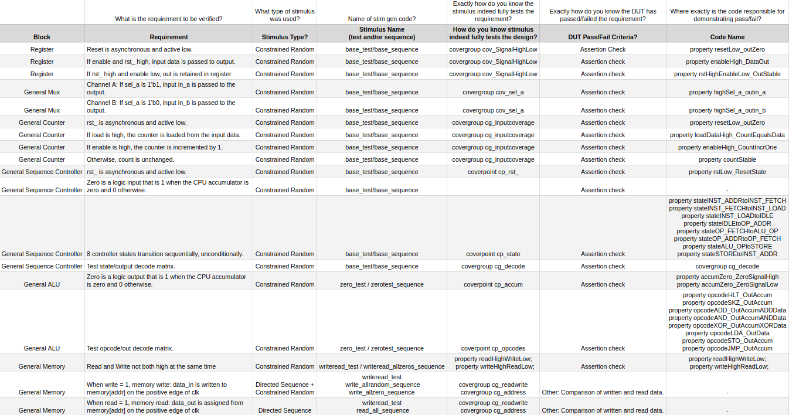
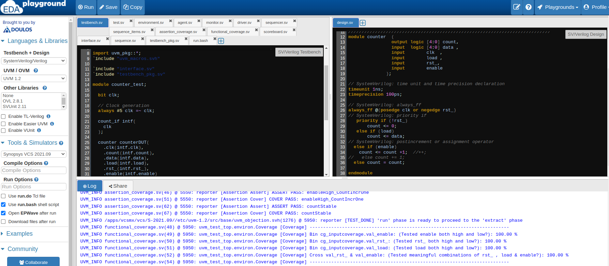

# Verification Practice Project #1: Simple CPU

## Howdy!

Below is my first self-motivated verification project.

I found an *extremely* simple CPU, created a verification plan, and built a testbench in EDAplayground to execute the plan.

My goal was to understand how verification tools and concepts (SV, UVM, SVA, functional coverage, etc.) work in concert, and to gain insight into some of the verification challenges I have read about (importance of reusability, impact of testbench architecture choices, etc).

I am looking for feedback, before beginning a second, more complex project:
1. Do you have any criticism of the verification plan or testbenches?
2. Do you think the approach of building increasingly complex testbenches while seeking industry feedback is a reasonable approach to landing a DV engineering role, or is it foolish?
3. What skills or concepts would my next project need to demonstrate if it were to prove that I have the skill to be on your team, are there concepts or methodologies I should incorporate to become a more competitive applicant?  (I am not planning to incorporate generative AI, until I have rock-solid understanding of verification fundamentals, first) Current plan
Is the BOOM core a good project?  
* Berkeley Out-of-Order Machine (BOOM) Core with Ocelot
* Instruction Set Set Simulator (Whisper)
* Hierarchical reuse
* Verilator
* Improve SVA skills
* RISC ISA testing

All input is much appreciated.  Thank you!

Taylor Templeton 

(A Raleigh, NC based engineer and cool dude with a semiconductor fabrication background (process, integration, quality) upskilling to become a competitive applicant for an entry-level design verification role.)

([Resume](2023_05_May_22_TaylorTempleton_GithubVersion.pdf)) 

## Simple CPU
This CPU is from a Cadence "systemverilog for design" course.  I used the RTL only, but built the testbench entirely myself.

## Verification Plan
Inspiried by openHW, piziali mehta.
([Verification Plan](Draft_VerificationPlan.xlsx)) 

## Testbench Architecture
UVM_cookbook, OpenHW tb, Cadence online training.

## EDA Playground Simulations
I use EDA playground as I do not have access to commercial simulators:

| Block                | EDA Playground Simulation            |
|----------------------|--------------------------------------|
| Whole CPU            |                                      |
| Register             | https://www.edaplayground.com/x/d_zE |
| MUX                  | https://www.edaplayground.com/x/v_VC |
| Counter              | https://www.edaplayground.com/x/wXAi |
| Sequencer Controller | https://www.edaplayground.com/x/abRt |
| ALU                  | https://www.edaplayground.com/x/JT9j |
| Memory               | https://www.edaplayground.com/x/K4_Z |

Example EDAplayground log.  (Results printed to log instead of exported with Synopsis URG for readability.)

## Lessons Learned
* TB reusability is key.
  * Even for a simple design, huge percentage of time was reprogamming the same components for different IP blocks.
* Consistency in naming at interfaces seems critical for reusability
* Plan to try to implement assertions in checker module
* Need to improve SVA skills, they are marginal.
* Want to try to implement formal.

