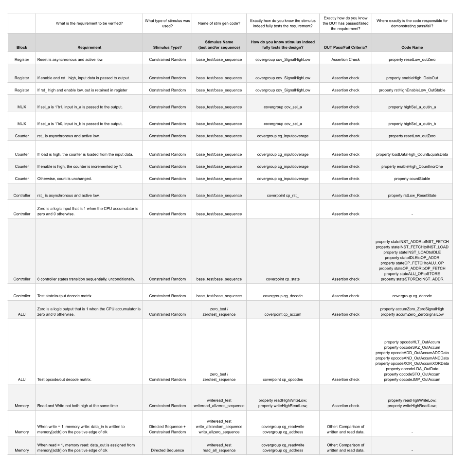
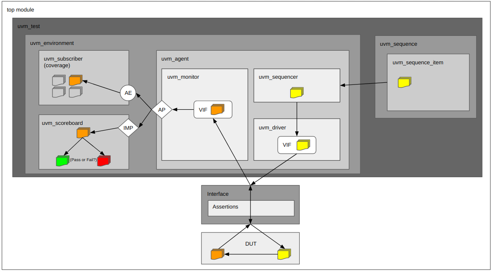
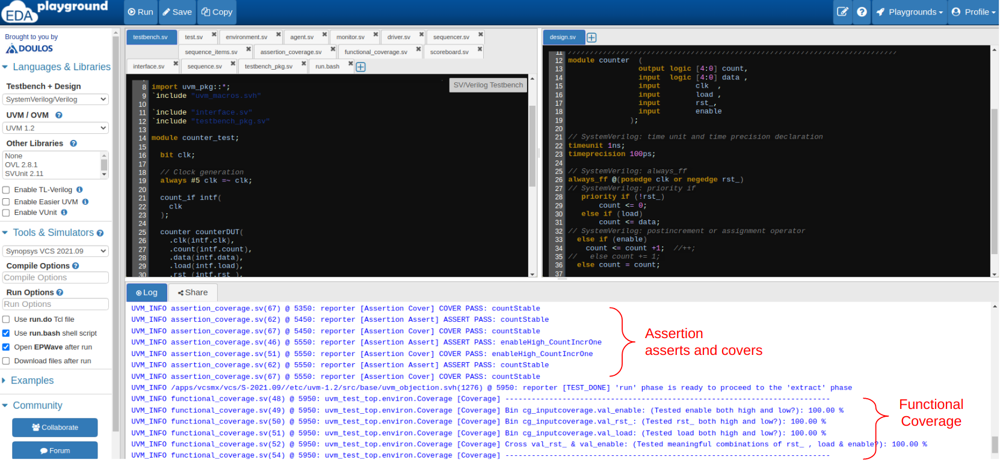
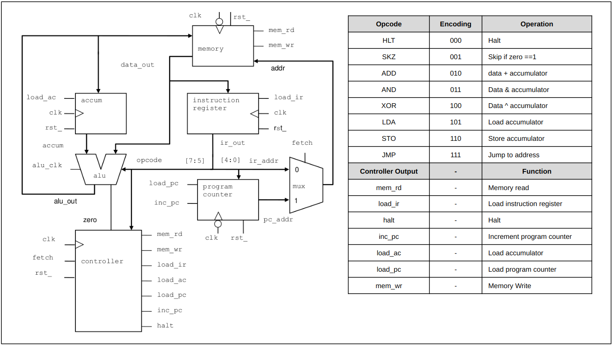
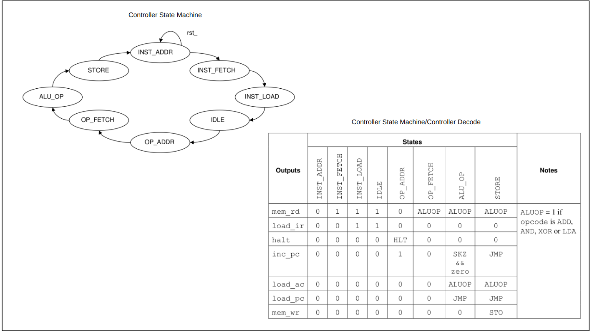

# Verification Practice Project #1: Simple CPU

## Hello!

Below is my first, and self-assigned, verification project.

I found an *extremely* simple CPU, created a verification plan, and built a testbench in EDAplayground to execute the plan.

My goal was to understand how verification tools (SV, UVM, SVA, functional coverage, etc.) work in concert, before attempting a more complex DUT.

I am looking for feedback, before beginning another project:
1. Do you have any criticism of the verification plan or testbenches below?
2. Are there any skills, concepts or architectures my next project could incorporate to demonstrate I would be a solid entry-level DV addition?  Next, I plan to try to verify aspects of the Berkeley Out-of-Order Machine (BOOM) Core with the Ocelot vector unit.
3. Do you think building increasingly complex testbenches is a reasonable approach to landing an entry level DV engineering role?

All input is much appreciated.  Thank you!

Taylor Templeton 

(I am a Raleigh, NC based engineer with a semiconductor fabrication background reskilling to apply for an entry-level design verification role. [Resume](2023_05_May_22_TaylorTempleton_GithubVersion.pdf)) 

## Verification Plan

I created my verification plan based on the following resources:
* Andrew Piziali's "Functional Verification Coverage Measurment and Analysis"
* James Peet's  "Verification plans : the five-day verification strategy for modern hardware verification languages"
* The Siemens' Verification Academy's "UVM Cookbook" and "Coverage Cookbook"
* The OpenHW Group's Core-V Verification Project verification plans

([Verification Plan Excel](Draft_VerificationPlan.xlsx)) 

## Testbench Architecture

I created my testbench architecture based on the following resources:
* The Siemens' Verification Academy's "UVM Cookbook" and "Coverage Cookbook"

## EDA Playground Simulations

I use EDA playground, as I do not have access to commercial simulators:

| Block                | EDA Playground Simulation            |
|----------------------|--------------------------------------|
| Whole CPU            |                                      |
| Register             | https://www.edaplayground.com/x/d_zE |
| MUX                  | https://www.edaplayground.com/x/v_VC |
| Counter              | https://www.edaplayground.com/x/wXAi |
| Sequencer Controller | https://www.edaplayground.com/x/abRt |
| ALU                  | https://www.edaplayground.com/x/JT9j |
| Memory               | https://www.edaplayground.com/x/K4_Z |

Example EDAplayground log.  (Results printed to log instead of exported with Synopsis URG for readability.)

## Simple CPU

This CPU is from a Cadence "systemverilog for design" course.  I used the RTL only, but built the testbench entirely myself.

## Lessons Learned

* TB reusability is key; even with such a simple design, a huge percentage of time was reprogamming the same components for different IP blocks.
* Consistency in naming at interfaces seems critical for reusability.
* Plan to try to implement assertions in checker module.
* Need to improve SVA skills, they are marginal.

