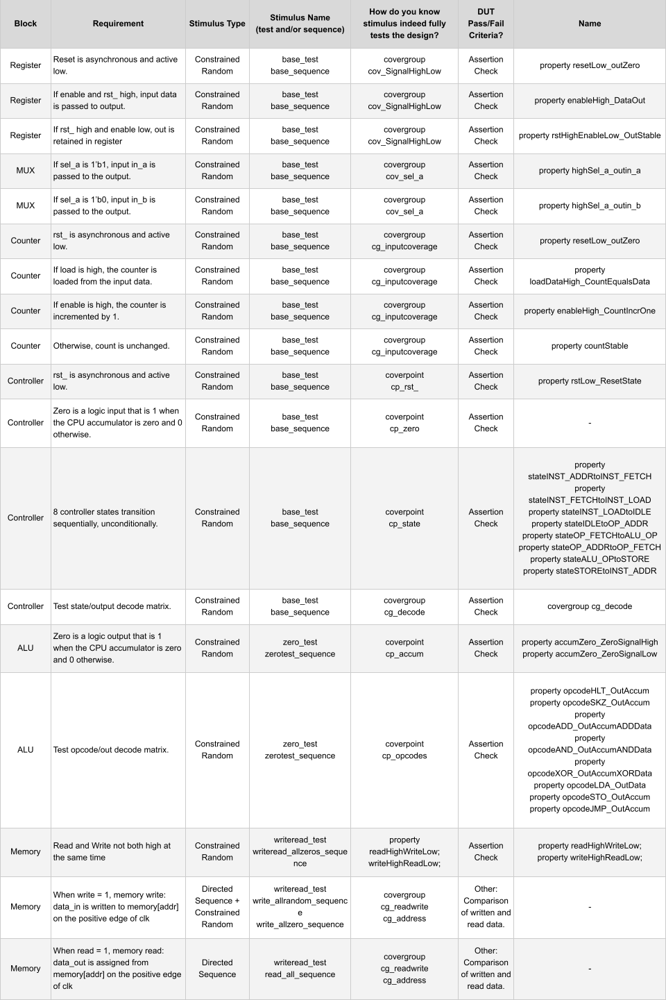

# Verification Practice Project #1: Simple CPU

## Hello!

I am hoping for feedback on my below self-assigned verification project.  

I am a Raleigh, NC based engineer with a semiconductor fabrication background, reskilling in hopes of landing an entry-level design verification role. ([Resume](2023_05_May_25_TaylorTempleton_GithubVersion.pdf))  

This project is my first step in building a verification portfolio.

The project: Use an extremely simple CPU to create a verification plan, build a testbench in EDAplayground, and execute the plan.

The goal: to build understanding of how verification tools work together (SV, UVM, SVA, functional coverage, etc.), before attempting a more complex project.

The ask: I am looking for feedback.
  1. Do you have any criticism of the verification plan, testbenches or simulations below?
  2. Do you think building a portfolio of increasingly complex testbenches is a reasonable approach to landing an entry level DV engineering role?  
  3. Are there any skills, methodologies or architectures my next project could incorporate to demonstrate I am prepared to contribute in an entry-level DV engineer?  For my next project I am considering focusing on Berkley’s OoO risc-v BOOMcore.

All input is much appreciated.  Thank you!

Taylor Templeton
taylor.templeton@gmail.com

## EDA Playground Simulations

I work within EDA playground, as I do not have access to commercial simulators and there is no EDAPlayground/Github sync.

| Block                | EDA Playground Simulation            |
|----------------------|--------------------------------------|
| Register Block       | https://www.edaplayground.com/x/Y5kQ |
| MUX Block            | https://www.edaplayground.com/x/v_VC |
| Counter Block        | https://www.edaplayground.com/x/wXAi |
| Controller Block     | https://www.edaplayground.com/x/L57G |
| ALU Block            | https://www.edaplayground.com/x/JT9j |
| Memory Block         | https://www.edaplayground.com/x/K4_Z |
| **Full CPU**         | https://www.edaplayground.com/x/hBNp |

Example EDAplayground log.  Results printed to log instead of exported with Synopsis URG for readability.

## Verification Plan

I created my verification plan guided by the resources cited at bottom.

([Verification Plan Excel](Draft_VerificationPlan.xlsx)) 

## Testbench Architecture

I created my testbench architecture guided by the resources cited at bottom.

# Testbench Architecture

## Simple CPU

This CPU RTL comes from a Cadence "Systemverilog for Design" course.  I used the RTL, but built the testbench myself.

## Lessons Learned / Next Steps

* TB reusability is key; even with such a simple design, a huge percentage of time was reprogamming the same components for different IP blocks.
* Consistency in naming at interfaces seems critical for reusability.
* Plan to try to implement assertions in checker module.
* Need to improve SVA skills, they are marginal.

## Sources
While this project is self-driven/assigned, I would not want to take credit for the sources upon which I drew:
* Andrew Piziali's "Functional Verification Coverage Measurment and Analysis"
* James Peet's  "Verification plans : the five-day verification strategy for modern hardware verification languages"
* The Siemens' Verification Academy's "UVM Cookbook" and "Coverage Cookbook"
* The OpenHW Group's Core-V Verification Project verification plans
* "Getting Started with UVM: A Beginner's Guide" by Vanessa Cooper

